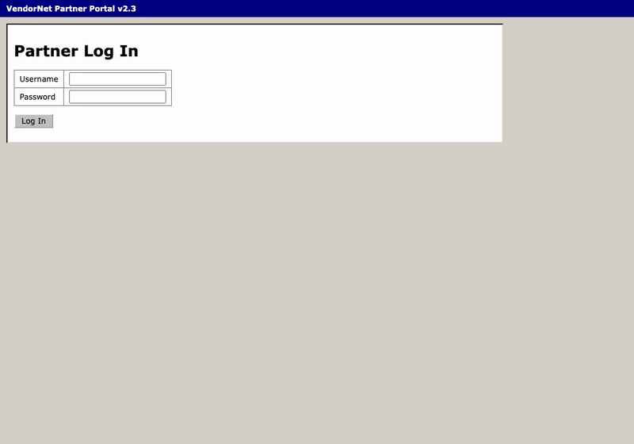
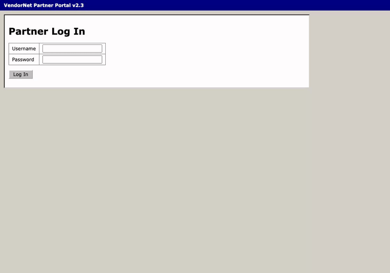
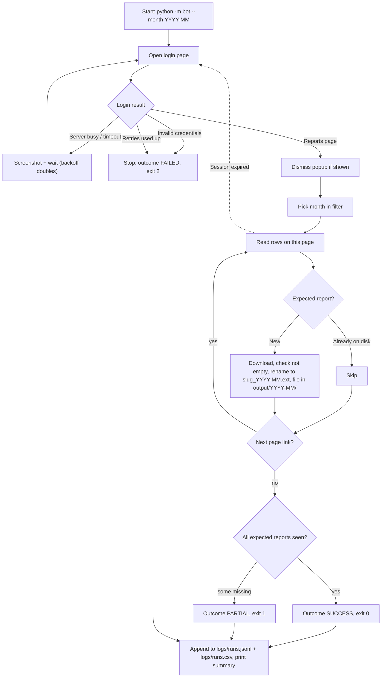

# Legacy Portal Report Bot

Every month someone logs into an old vendor portal that has no API, downloads a stack of reports one by one, renames them and files them into folders. This bot does that job unattended, and when something goes wrong it says so in a run log instead of failing silently.

> **This is code-based RPA, built in Python with [Playwright](https://playwright.dev/python/).** It is not UiPath or Power Automate Desktop. The ideas are the same (selectors, retries, exception handling, scheduling), written as code. See [the mapping table](#how-this-maps-to-uipath--power-automate).

| Broken login, then recovery | Missing report, run marked `partial` |
|---|---|
|  |  |

The bot only ever talks to the **fake portal in this repo** (`portal/`), using made-up credentials. No real sites, no real accounts.

## How it works



## Setup

Python 3.10+ (CI uses 3.12).

```bash
python3 -m venv .venv
source .venv/bin/activate
pip install -r requirements.txt
python -m playwright install chromium
cp .env.example .env
```

`.env` holds the demo username and password. It is git-ignored. The portal and the bot both read it, so they always agree.

## Run the portal

```bash
python -m portal
```

It serves http://127.0.0.1:5050 (change the port with `PORTAL_PORT`). You can log in by hand with the values in `.env`.

**Fault switches** are environment variables you set when starting the portal:

| Switch | Example | Effect |
|---|---|---|
| `FAIL_FIRST_LOGIN` | `FAIL_FIRST_LOGIN=1` | First login after startup returns "Server busy, try again" (HTTP 503). Later logins work. |
| `SLOW_MODE` | `SLOW_MODE=2` | Every page waits a random 0–2 seconds. |
| `MISSING_REPORT` | `MISSING_REPORT=vendor-payments:2026-09` | That report is absent for that month. |
| `SHOW_POPUP` | `SHOW_POPUP=1` | A maintenance notice modal blocks the page after login until dismissed. |
| `SESSION_TIMEOUT` | `SESSION_TIMEOUT=6` | Session expires after 6 requests, forcing a re-login. |

For example: `FAIL_FIRST_LOGIN=1 SHOW_POPUP=1 python -m portal`

## Run the bot

With the portal running, in a second terminal:

```bash
python -m bot --month 2026-09               # headless
python -m bot --month 2026-09 --headed      # watch the browser
python -m bot --trigger scheduled           # what the scheduler runs; month defaults to last month
python -m bot --month 2026-09 --video logs/videos   # record a video (slowed down so it's watchable)
```

Files land in `output/2026-09/` as `sales-summary_2026-09.csv`, `inventory-levels_2026-09.xlsx` and so on.
**Exit codes:** `0` success, `1` partial, `2` failed.

Settings (portal URL, expected reports, output folder, retry counts, timeouts) live in [`config.yaml`](config.yaml).

## Run the tests

```bash
pytest -v
```

The tests start their own portal on a free port, one per test with that test's fault switches, so you don't need `python -m portal` running. They cover: happy path, `FAIL_FIRST_LOGIN` (2 login attempts), wrong password (clean stop), `MISSING_REPORT` (`partial`), re-run (skips), session timeout plus popup (re-login and finish), a source scan that fails on any coordinate-based call, and deterministic sample files. GitHub Actions runs the same tests headless on every push ([`.github/workflows/tests.yml`](.github/workflows/tests.yml)).

## Run the demo scenarios

```bash
./scripts/run_demos.sh
```

This starts the portal three times (normal, `FAIL_FIRST_LOGIN`, `MISSING_REPORT`), runs the bot with video recording, and converts the recordings to `docs/demo/*.gif` with ffmpeg. Each run is appended to `logs/runs.csv`.

## What happens when things go wrong

| Situation | What the bot does | Outcome |
|---|---|---|
| "Server busy" page (503), page timeout, portal down | Screenshot, wait (1s, 2s, 4s… capped at 8s), retry. Up to 4 attempts. | Continues if a retry works. `failed` if all attempts fail. |
| Wrong username or password | Screenshot, log the portal's own message, **stop immediately**. Retrying won't fix credentials and could lock the account. | `failed`, exit 2 |
| Popup notice after login | Dismissed automatically whenever it appears. Nothing happens if it never does. | no effect |
| Session expires mid-run | Notices the login page, logs in again, picks up where it left off (finished files are skipped). Max 5 re-logins. | still `success` if it completes |
| Expected report not on the portal | Records it as missing, keeps downloading the rest | `partial`, exit 1 |
| Download fails, file empty, or unexpected file type | Screenshot, log the error, move to the next report | `partial`, exit 1 |
| File already downloaded in an earlier run | Skips it, so re-running is always safe | counted as `skipped` |
| Anything unexpected | Screenshot, one-line error in the log, no raw traceback | `failed`, exit 2 |

Every run appends one line to `logs/runs.jsonl` and one row to `logs/runs.csv` with: `run_id, trigger, started_at, finished_at, duration_seconds, month, outcome, downloaded, skipped, missing, login_attempts, errors, screenshots`. Screenshots go to `logs/screenshots/`. A real sample is in [`docs/sample-run-log.csv`](docs/sample-run-log.csv).

## Scheduling (unattended)

The portal must be running when the scheduled job fires.

**macOS (launchd).** The job in [`scheduling/com.legacyportalbot.monthly.plist`](scheduling/com.legacyportalbot.monthly.plist) runs at 07:00 on the 1st of each month with `--trigger scheduled`. The helper fills in the repo path and loads it:

```bash
./scheduling/install_launchd.sh            # install monthly schedule
./scheduling/install_launchd.sh remove     # uninstall
```

**To prove scheduling works**, get one real `scheduled` row into the log:

1. Start the portal: `python -m portal`
2. `./scheduling/install_launchd.sh 3` (fires 3 minutes from now)
3. Wait, then check `logs/runs.csv` for a row with `trigger = scheduled`, plus `logs/launchd.out.log`
4. `./scheduling/install_launchd.sh` to go back to the monthly schedule. The demo time would otherwise repeat daily.

If the job fails with "Operation not permitted", macOS privacy protection is blocking background access to `~/Documents`. Either move the repo outside `Documents`/`Desktop`, or give the venv's Python Full Disk Access in System Settings → Privacy & Security.

**cron alternative** (one line in `crontab -e`):

```
0 7 1 * * cd /path/to/legacy-portal-bot && .venv/bin/python -m bot --trigger scheduled >> logs/cron.log 2>&1
```

**Windows Task Scheduler.** Run once in Command Prompt:

```
schtasks /create /tn "LegacyPortalBot" /sc monthly /d 1 /st 07:00 /tr "cmd /c cd /d C:\path\to\legacy-portal-bot && .venv\Scripts\python -m bot --trigger scheduled"
```

Or in the Task Scheduler app: Create Basic Task → Monthly → day 1 → Start a program → `cmd` with arguments `/c cd /d C:\path\to\legacy-portal-bot && .venv\Scripts\python -m bot --trigger scheduled`.

## Results

Measured on the same task (log in, download all 7 reports for one month, rename and file them):

| | Time |
|---|---|
| By hand | _TBD_ |
| Bot | _TBD_ |

_Numbers to be filled in from my own timings._

## How this maps to UiPath / Power Automate

| Concept | This project | UiPath | Power Automate Desktop |
|---|---|---|---|
| Selectors | Playwright locators: `get_by_label`, `get_by_role`, `get_by_test_id` (no coordinates) | Selectors / UI Explorer, Object Repository | UI elements |
| Retry scope | `tenacity` retry with exponential backoff around login | Retry Scope | Action "On error" → retry action |
| Exception handling | Transient vs permanent error classes, screenshot on error, clean `failed` outcome | Try Catch, Throw, Business vs System exceptions (REFramework) | On block error, Get last error |
| Config & credentials | `config.yaml` + `.env` | Config.xlsx + Orchestrator Assets / Credentials | Flow variables + credentials |
| Scheduling / orchestration | launchd / cron / Task Scheduler, `--trigger scheduled`, exit codes, run log | Orchestrator time triggers, unattended robots, job logs | Cloud flow with a recurrence trigger running the desktop flow unattended, run history |

## Project layout

```
portal/            fake legacy portal (Flask): login, reports table, downloads, fault switches
bot/               the bot: runner.py (browser steps), runlog.py (run log), __main__.py (CLI)
tests/             pytest suite; starts the portal itself
scheduling/        launchd plist + installer
scripts/           run_demos.sh: recorded demo scenarios -> GIFs
docs/              demo GIFs, sample run log
config.yaml        bot settings
LIMITATIONS.md     what would break the bot, and what it doesn't do
```
